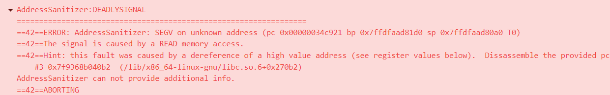

# 栈与队列刷题整理

#### [20. 有效的括号](https://leetcode-cn.com/problems/valid-parentheses/)

有两个测试用例"]"和"["，需要注意。

```c++
    bool isValid(string s) {
        stack<char> char_stack;
        map<char, char> char_map = { {'{','}'},{'[',']'},{'(',')'} };
        for (char a:s){
            if (a == '{'|| a== '[' || a == '('){
                char_stack.push(a);
            }else{
                if (char_stack.empty() == true) return false;
                char b = char_stack.top();  
                char_stack.pop();   
                if (char_map[b] != a) return false;
            }    
        }
        return char_stack.empty();
    }
```

#### [1047. 删除字符串中的所有相邻重复项](https://leetcode-cn.com/problems/remove-all-adjacent-duplicates-in-string/)

出现了类似这种的问题：



这种情况就是没有引用到正确的内容，原因如下：

```c++
    string removeDuplicates(string s) {
        stack<char> unique_stack;
        int count = s.size();

        for (int i = s.size() - 1; i >= 0; i--) {
            //if (unique_stack.top() == s[i]) unique_stack.pop(); // 没有考虑到开始的时候栈为空的一个现象
            if (unique_stack.empty() != true && unique_stack.top() == s[i]) unique_stack.pop();
            else unique_stack.push(s[i]);
        }
        string result_string = "";

        while (unique_stack.empty() == false) {
            result_string += unique_stack.top();
            unique_stack.pop();
        }
        return result_string;
    }
```

但是速度还是慢，直接用字符串做栈速度要快很多。

```c++
string removeDuplicates(string S) {
        string result;
        for(char s : S) {
            if(result.empty() || result.back() != s) {
                result.push_back(s);
            }
            else {
                result.pop_back();
            }
        }
        return result;
    }

```

